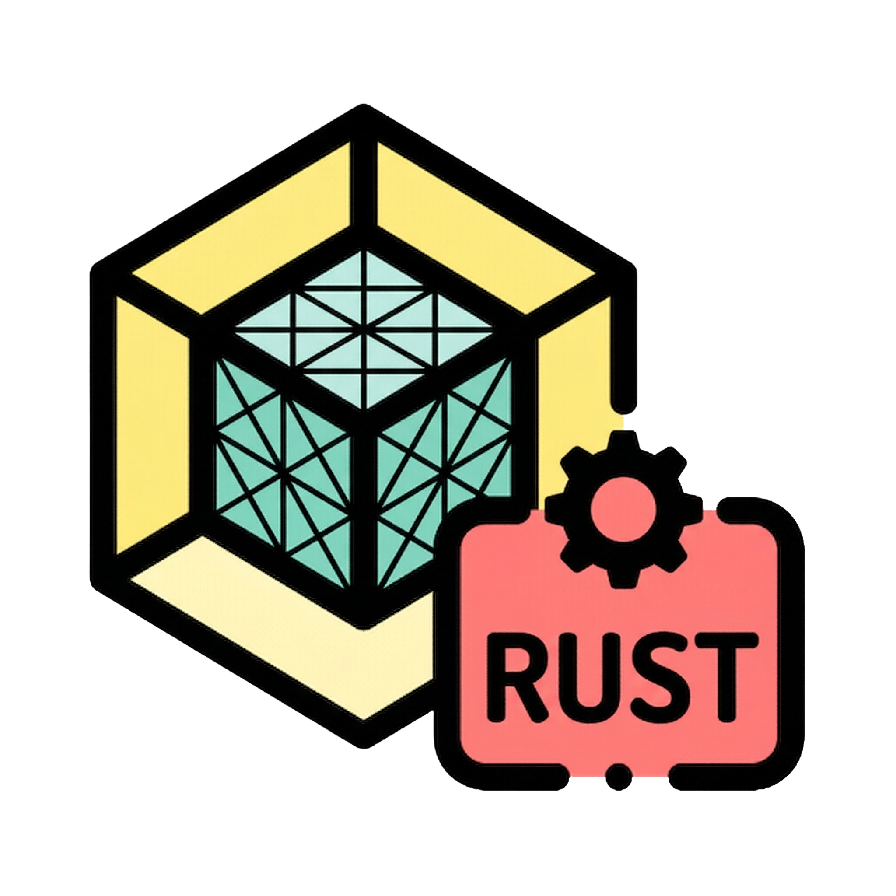
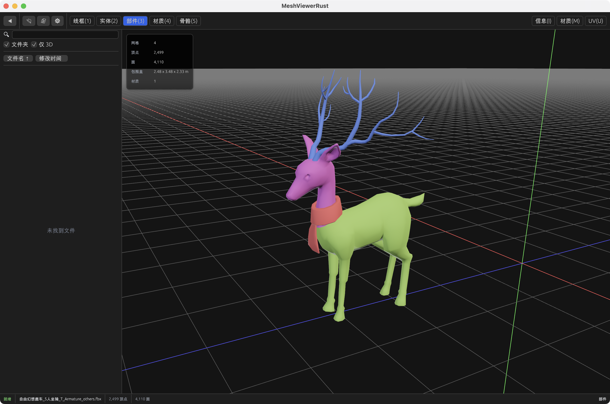
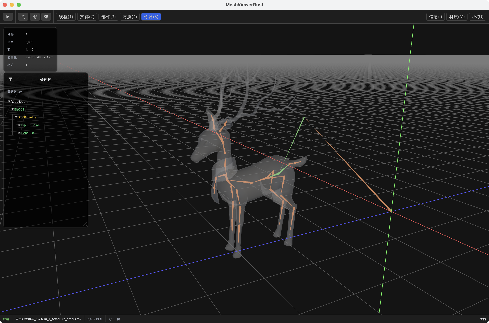

# MeshViewerRust

<p align="center">
  
</p>

[中文](#中文) | [English](#english)

---

## 中文

MeshViewerRust 是一个基于 Rust + Bevy 的桌面 3D 网格查看器，目标是提供轻量、快速、可扩展的模型浏览与调试体验。  
当前重点面向模型预览、结构检查（网格/材质/骨骼/UV）和基础工作流集成（如拖拽打开、文件浏览、可选 Blender 打开）。

### 功能特性

- 多渲染模式：线框、实体、部件、材质、骨骼（动画模式预留）
- 右侧信息面板：模型统计、材质信息、UV 面板
- 文件加载方式：命令行参数、文件对话框、目录浏览、拖拽文件
- 快捷键工作流：模式切换与面板切换
- 中英文 UI 本地化
- 设置持久化（TOML）
- macOS Finder 打开文件支持（项目内含对应插件）

### 预览图

| 预览图 1 | 预览图 2 |
| --- | --- |
|  |  |

### 支持的模型格式

当前内置识别的扩展名：

`glb`, `gltf`, `fbx`, `obj`, `stl`, `ply`, `dae`, `3ds`

> 说明：不同格式的实际解析能力受底层依赖与文件内容影响。

### 技术栈

- Rust (Edition 2024)
- [Bevy](https://bevyengine.org/)
- [bevy_egui](https://github.com/mvlabat/bevy_egui)
- [russimp-ng](https://crates.io/crates/russimp-ng)
- [rfd](https://crates.io/crates/rfd)

### 快速开始

#### 1) 环境准备

- 安装 Rust（建议使用最新 stable 工具链）
- 安装平台编译工具链（例如 macOS 上的 Xcode Command Line Tools）

#### 2) 拉起项目

```bash
cargo run
```

可选：启动时直接打开模型文件

```bash
cargo run -- /path/to/model.fbx
```

### 常用快捷键

- `1`：线框模式
- `2`：实体模式
- `3`：部件视图
- `4`：材质预览
- `5`：骨骼模式
- `B`：切换左侧边栏
- `I`：切换信息面板
- `M`：切换材质面板
- `U`：切换 UV 面板
- `F`：视角适配（Fit to View）
- `Ctrl/Cmd + O`：打开模型文件
- `Ctrl/Cmd + Shift + O`：打开目录
- `Ctrl/Cmd + ,`：打开设置

### 配置说明

默认配置样例位于：

- `config/default_settings.toml`

运行时设置会写入系统配置目录（按平台自动选择），应用重启后会保留：

- 语言、主题
- 启动默认模式
- 渲染参数（如线框颜色、骨骼显示参数等）
- Blender 可执行文件路径（可选）

### macOS 打包

项目提供脚本用于打包 `.app`：

```bash
./scripts/bundle_macos.sh
```

调试构建：

```bash
./scripts/bundle_macos.sh debug
```

### Roadmap（计划中）

- UV 预览能力完善
- 动画模式与播放控制增强
- 更完整的跨平台打包与分发流程
- 更多渲染与调试辅助选项

### 贡献

欢迎 Issue 和 PR。  
建议在提交前先运行本地检查：

```bash
cargo fmt
cargo clippy --all-targets --all-features -- -D warnings
cargo test
```

### 许可证

本项目采用 `MIT` 许可证，详见 `LICENSE`。

---

## English

MeshViewerRust is a desktop 3D mesh viewer built with Rust + Bevy, focused on lightweight, fast, and extensible model inspection workflows.  
It currently targets practical preview/debug use cases such as mesh/material/skeleton/UV inspection and basic workflow integrations (file dialog, drag-and-drop, optional Blender handoff).

### Features

- Multiple render modes: Wireframe, Solid, Component, Material, Skeleton (Animation reserved)
- Right-side panels for model stats, material details, and UV panel
- Multiple load entry points: CLI argument, file dialog, directory browser, drag-and-drop
- Keyboard-first workflow for mode/panel switching
- Built-in Chinese/English localization
- Persistent settings via TOML
- macOS Finder open-file support plugin

### Screenshots

| Preview 1 | Preview 2 |
| --- | --- |
|  |  |

### Supported Formats

Recognized file extensions:

`glb`, `gltf`, `fbx`, `obj`, `stl`, `ply`, `dae`, `3ds`

> Note: Actual parsing quality depends on file content and underlying importer support.

### Tech Stack

- Rust (Edition 2024)
- [Bevy](https://bevyengine.org/)
- [bevy_egui](https://github.com/mvlabat/bevy_egui)
- [russimp-ng](https://crates.io/crates/russimp-ng)
- [rfd](https://crates.io/crates/rfd)

### Quick Start

#### 1) Prerequisites

- Rust (latest stable recommended)
- Platform build toolchain (e.g., Xcode Command Line Tools on macOS)

#### 2) Run

```bash
cargo run
```

Optional: open a model at startup

```bash
cargo run -- /path/to/model.fbx
```

### Keyboard Shortcuts

- `1`: Wireframe mode
- `2`: Solid mode
- `3`: Component view
- `4`: Material preview
- `5`: Skeleton mode
- `B`: Toggle left sidebar
- `I`: Toggle info panel
- `M`: Toggle material panel
- `U`: Toggle UV panel
- `F`: Fit to view
- `Ctrl/Cmd + O`: Open file
- `Ctrl/Cmd + Shift + O`: Open directory
- `Ctrl/Cmd + ,`: Open settings

### Configuration

Default config reference:

- `config/default_settings.toml`

Runtime settings are persisted in an OS-specific config directory, including:

- locale and theme
- default startup mode
- render parameters (wireframe/skeleton options, etc.)
- optional Blender executable path

### macOS Bundle

Build `.app` bundle:

```bash
./scripts/bundle_macos.sh
```

Debug bundle:

```bash
./scripts/bundle_macos.sh debug
```

### Roadmap

- Better UV preview implementation
- Enhanced animation mode and playback controls
- More complete cross-platform packaging/distribution
- Additional rendering/debugging helpers

### Contributing

Issues and PRs are welcome.  
Before opening a PR, run:

```bash
cargo fmt
cargo clippy --all-targets --all-features -- -D warnings
cargo test
```

### License

This project is licensed under the `MIT` License. See `LICENSE` for details.
